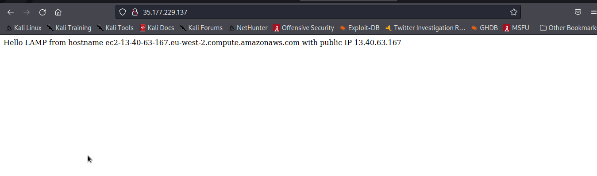

# Project-2-LEMP-Stack-Implementation-on-AWS
This repository explains the steps involved in creating and hosting a LEMP server on AWS. An open-source web application stack called LEMP is used to create websites.
The abbreviation LEMP stands for Linux Operating System, Nginx (pronounced engine-x, hence the E in the acronym), MySQL Database, and PHP Scripting Language.

### Step 1: Create a Virtual Server on AWS
<!-- UL -->
* Login to the AWS console
* Search for EC2 (Elastic Compute Cloud) 
* Select your preferred region (the closest to you) and launch a new EC2 instance of t2.micro family with Ubuntu Server 20.04 LTS (HVM)
* Type a name e.g My_Lamp_Server
 Click create a new key pair, use any name of your choice as the name for the pem file and select .pem.
    * Linux/Mac users, choose .pem for use with openssh. This allows you to connect to your server using open ssh clients.
    * For windows users choose .ppk for use with putty. Putty is a software that lets you connect remotely to servers
* Save your private key (.pem file) securely and do not share it with anyone! If you lose it, you will not be able to connect to your server ever again! 

### Step 2: Installing Apache and Updating the Firewall
* First, update the server using the command

    `sudo apt update`

    

* Now, install nginx using the command below

    `sudo apt install nginx`
      
* Check the status of the nginx service

    `sudo systemctl status nginx`
    
* Access the server locally in the ubuntu shell using cURL

    `curl http://localhost:80`

        or using the ip address in the command below
    >`curl http://127.0.0.1:80`

* Open a web browser of your choice and try to access following url 

    >`http://<Public-IP-Address>:80`

    
* You can also retrieve your ip address instead of checking the aws console using cURL as in the command below
    `curl -s http://169.254.169.254/latest/meta-data/public-ipv4`
     

### Step 3 - Installing MySQL
Now that you have a web server up and running, you need to install a Relational Database Management System (RDBMS) to be able to store and manage data for your site. MySQL is a popular relational database management system used within PHP environments, so we will use it in our project.

* install my-sql server using the command below

>`sudo apt install mysql-server`

* When the installation is finished, log in to the MySQL console by typing:

>`sudo mysql -root -p`

Type the root db password when prompted for a password

* Start the interactive script by running:
>`$ sudo mysql_secure_installation`

* To exit the MySQL console, type:

>`mysql> exit`

### Step 4 - Installing php
You have Nginx installed to serve your content and MySQL installed to store and manage your data. Now you can install PHP to process code and generate dynamic content for the web server.

* First, install these two packages using one command
`sudo apt install php-fpm php-mysql -y`

### Step 5 - Configuring Nginx To Use PHP Processor
When using the Nginx web server, we can create server blocks (similar to virtual hosts in Apache) to encapsulate configuration details and host more than one domain on a single server. Here, we will use projectLEMP as an example domain name.

* Create the root web directory for your domain as follows:

`sudo mkdir /var/www/projectLEMP`

* Next, Give recursive ownership of the directory with the $USER environment variable, which will reference your current system user:

* Now, open a new configuration file in Nginx’s sites-available directory using your preferred command-line editor. Here I use vim editor, you can use your preffered text editor, vim automatically creates a file and requires sudo privileges to save configs

`sudo vim /etc/nginx/sites-available/projectLEMP`

 Paste in the following bare-bones configuration:
 
            #/etc/nginx/sites-available/projectLEMP
        
        server {
            listen 80;
            server_name projectLEMP www.projectLEMP;
            root /var/www/projectLEMP;
        
            index index.html index.htm index.php;
        
            location / {
                try_files $uri $uri/ =404;
            }
        
            location ~ \.php$ {
                include snippets/fastcgi-php.conf;
                fastcgi_pass unix:/var/run/php/php8.1-fpm.sock;
            }
        
            location ~ /\.ht {
                deny all;
            }
        
        }
`
 
  

