# Project-2-LEMP-Stack-Implementation-on-AWS
This repository explains the steps involved in creating and hosting a LEMP server on AWS. An open-source web application stack called LEMP is used to create websites.
The abbreviation LEMP stands for Linux Operating System, Nginx (pronounced engine-x, hence the E in the acronym), MySQL Database, and PHP Scripting Language.

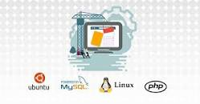

<!-- Horizontal RUle -->
---
___
### Step 1: Create a Virtual Server on AWS
<!-- UL -->
* Login to the AWS console
* Search for EC2 (Elastic Compute Cloud) 
* Select your preferred region (the closest to you) and launch a new EC2 instance of t2.micro family with Ubuntu Server 20.04 LTS (HVM)
* Type a name e.g My_Lamp_Server
 Click create a new key pair, use any name of your choice as the name for the pem file and select .pem.
    * Linux/Mac users, choose .pem for use with openssh. This allows you to connect to your server using open ssh clients.
    * For windows users choose .ppk for use with putty. Putty is a software that lets you connect to servers remotely.
* Save your private key (.pem file) securely and do not share it with anyone! If you lose it, you will not be able to connect to your server ever again! 

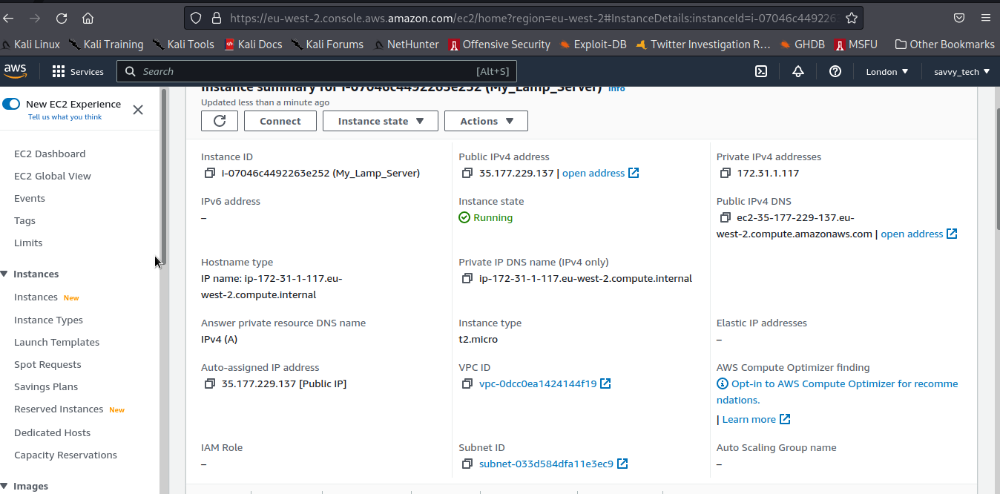

<!-- Horizontal RUle -->
---
___
### Step 2: Installing Apache and Updating the Firewall
* First, update the server using the command

    `sudo apt update`

    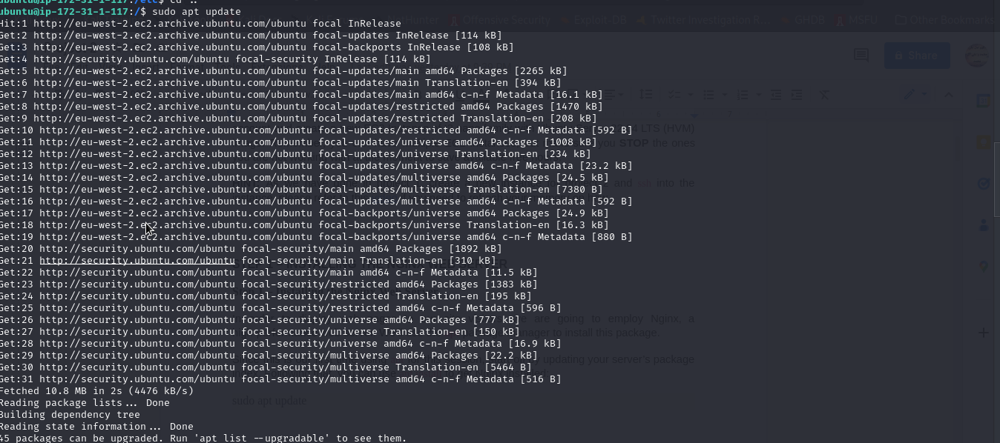

* Now, install nginx using the command below

    `sudo apt install nginx`
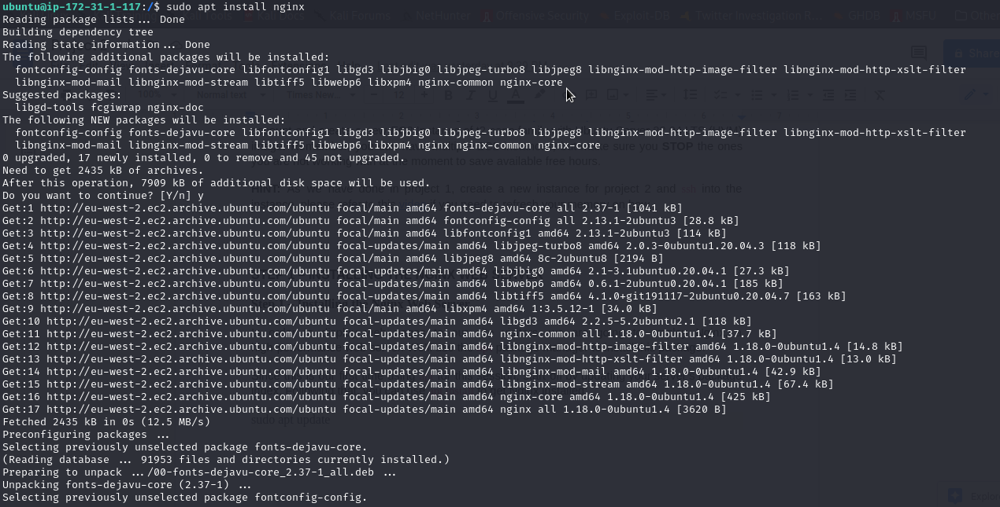
* Check the status of the nginx service

    `sudo systemctl status nginx`
    
* Access the server locally in the ubuntu shell using cURL

    `curl http://localhost:80`

        or using the ip address in the command below
    >`curl http://127.0.0.1:80`

* Open a web browser of your choice and try to access following url 

    >`http://<Public-IP-Address>:80`

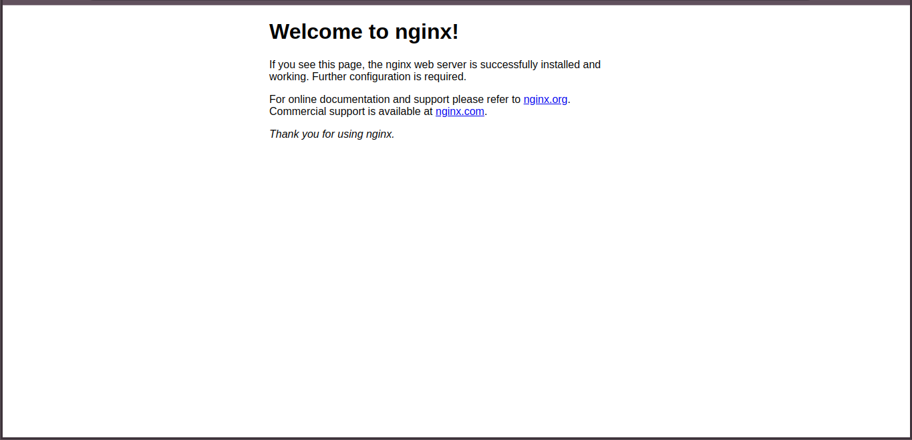

    
* You can also retrieve your ip address instead of checking the aws console using cURL as in the command below

    `curl -s http://169.254.169.254/latest/meta-data/public-ipv4`
    
     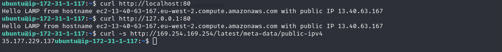

<!-- Horizontal RUle -->
---
___
### Step 3 - Installing MySQL
Now that you have a web server up and running, you need to install a Relational Database Management System (RDBMS) to be able to store and manage data for your site. MySQL is a popular relational database management system used within PHP environments, so we will use it in our project.

* install my-sql server using the command below

>`sudo apt install mysql-server`

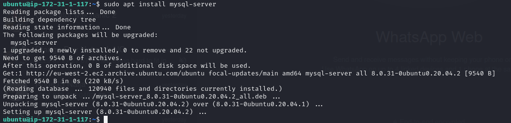

* When the installation is finished, log in to the MySQL console by typing:

>`sudo mysql -root -p`

Type the root db password when prompted for a password. You can type any combination of keys to login as root.

Now change the root password using. 
ALTER USER 'root'@'localhost' IDENTIFIED WITH mysql_native_password BY 'passWORD.1';
Replace 'PassWORD.1' with any password of your choice.

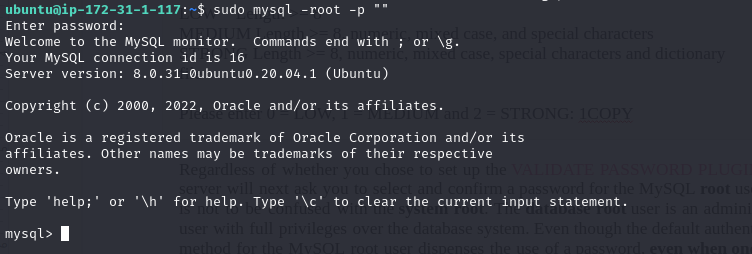

* Start the interactive script by running:
>`$ sudo mysql_secure_installation`

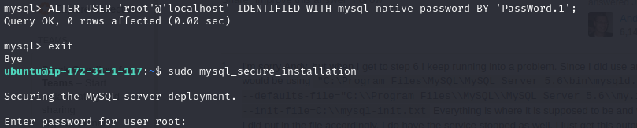

* To exit the MySQL console, type:

>`mysql> exit`

<!-- Horizontal RUle -->
---
___
### Step 4 - Installing php
You have Nginx installed to serve your content and MySQL installed to store and manage your data. Now you can install PHP to process code and generate dynamic content for the web server.

* First, install these two packages using one command
`sudo apt install php-fpm php-mysql -y`

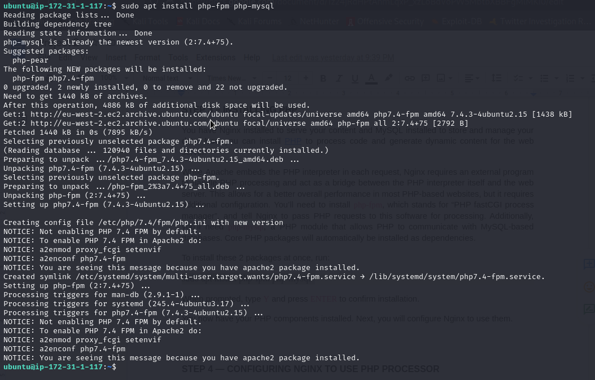

<!-- Horizontal RUle -->
---
___
### Step 5 - Configuring Nginx To Use PHP Processor
When using the Nginx web server, we can create server blocks (similar to virtual hosts in Apache) to encapsulate configuration details and host more than one domain on a single server. Here, we will use projectLEMP as an example domain name.

* Create the root web directory for your domain as follows:

`sudo mkdir /var/www/projectLEMP`
`cd /var/www/projectLEMP`

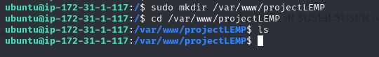

* Next, Give recursive ownership of the directory with the $USER environment variable, which will reference your current system user:

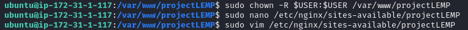

* Now, open a new configuration file in Nginx’s sites-available directory using your preferred command-line editor. Here I use vim editor, you can use your preffered text editor, vim automatically creates a file and requires sudo privileges to save configs

`sudo vim /etc/nginx/sites-available/projectLEMP`

 Paste in the following bare-bones configuration:

            #/etc/nginx/sites-available/projectLEMP
        
        server {
            listen 80;
            server_name projectLEMP www.projectLEMP;
            root /var/www/projectLEMP;
        
            index index.html index.htm index.php;
        
            location / {
                try_files $uri $uri/ =404;
            }
        
            location ~ \.php$ {
                include snippets/fastcgi-php.conf;
                fastcgi_pass unix:/var/run/php/php8.1-fpm.sock;
            }
        
            location ~ /\.ht {
                deny all;
            }
        
        }

press esc key, :wq! to save and exit.

* Next, Activate your configuration by linking to the config file from Nginx’s sites-enabled directory:

    `sudo ln -s /etc/nginx/sites-available/projectLEMP /etc/nginx/sites-enabled/`

  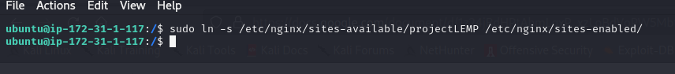

  You can test your configuration for syntax errors by typing:

    `sudo nginx -t`

    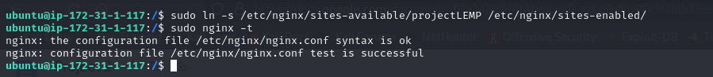

* We also need to disable default Nginx host that is currently configured to listen on port 80, for this run:

    `sudo unlink /etc/nginx/sites-enabled/default`

    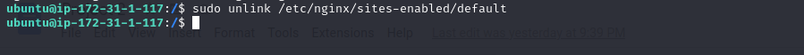
<!-- Horizontal RUle -->
---
___
### Step 6 - Testing PHP with nginx

At this point, your LEMP stack is completely installed and fully operational.
You can test it to validate that Nginx can correctly hand .php files off to your PHP processor.
You can do this by creating a test PHP file in your document root. Open a new file called info.php within your document root in your text editor:

   `sudo vim /var/www/projectLEMP/info.php`

* Type or paste the following lines into the new file. This is valid PHP code that will return information about your server:

            <?phpf
            phpinfo();

* Then reload and check the status of the nginx service using the following commands

    `sudo systemctl reload nginx`

    `sudo systemctl status nginx`

    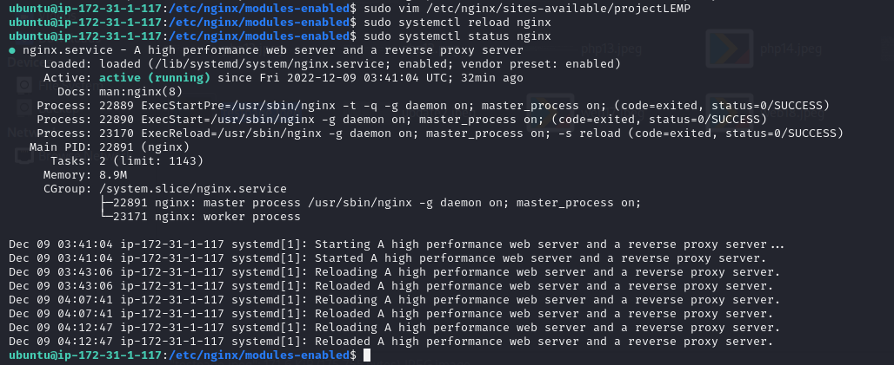

 * You can now access this page in your web browser by visiting the domain name or public IP address you’ve set up in your Nginx configuration file, followed by /info.php:
`http://server_domain_or_IP/info.php`

* You will see a web page containing detailed information about your server:
After checking the relevant information about your PHP server through that page, it’s best to remove the file you created as it contains sensitive information about your PHP environment and your Ubuntu server. You can use rm to remove that file:

    `sudo rm /var/www/your_domain/info.php`

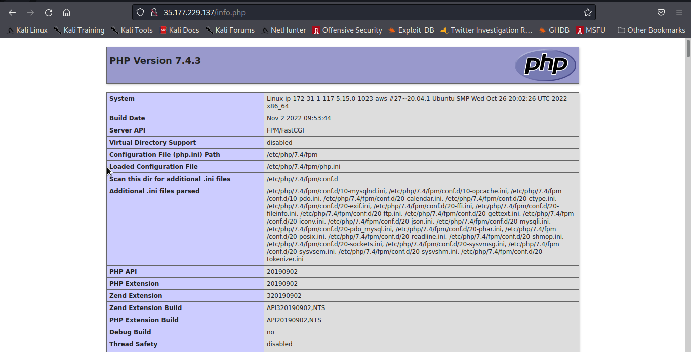

<!-- Horizontal RUle -->
---
___
### Step 7 — Retrieving data from MySQL database with PHP
* First, connect to the MySQL console using the root account:

    `sudo mysql -u root -p`

* To create a new database, run the following command from your MySQL console:

    `mysql> CREATE DATABASE `example_database`;`

* create a new user and grant him full privileges on the database you have just created. For security reasons I will be using a simple username and password which is different from the one in my actual configuration

    `mysql> CREATE USER 'example_user'@'%' IDENTIFIED WITH mysql_native_password BY 'password';`

* Now we need to give this user permission over the example_database database:

    `mysql> GRANT ALL ON example_database.* TO 'example_user'@'%';`

* This will give the example_user user full privileges over the example_database database, while preventing this user from creating or modifying other databases on your server.
Now exit the MySQL shell with:

    `mysql> exit`

* You can test if the new user has the proper permissions by logging in to the MySQL console again, this time using the custom user credentials:

`mysql -u example_user -p`

    Notice the -p flag in this command, which will prompt you for the password used when creating the example_user user. 
    
* After logging in to the MySQL console, confirm that you have access to the example_database database:

`mysql> SHOW DATABASES;`

                Output
        +--------------------+
        | Database       	|
        +--------------------+
        | example_database   |
        | information_schema |
        | performance_schema |
        +--------------------+
        3 rows in set (0.000 sec)

* Next, we’ll create a test table named todo_list. From the MySQL console, run the following statement:

        CREATE TABLE example_database.todo_list (
        mysql> 	item_id INT AUTO_INCREMENT,
        mysql> 	content VARCHAR(255),
        mysql> 	PRIMARY KEY(item_id)
        mysql> );

* Insert a few rows of content in the test table. You might want to repeat the next command a few times, using different VALUES:

`mysql> INSERT INTO example_database.todo_list (content) VALUES ("My first important item");`

You can add more items to the database as you wish.

To confirm that the data was successfully saved to your table, run:

`mysql> SELECT * FROM example_database.todo_list;`

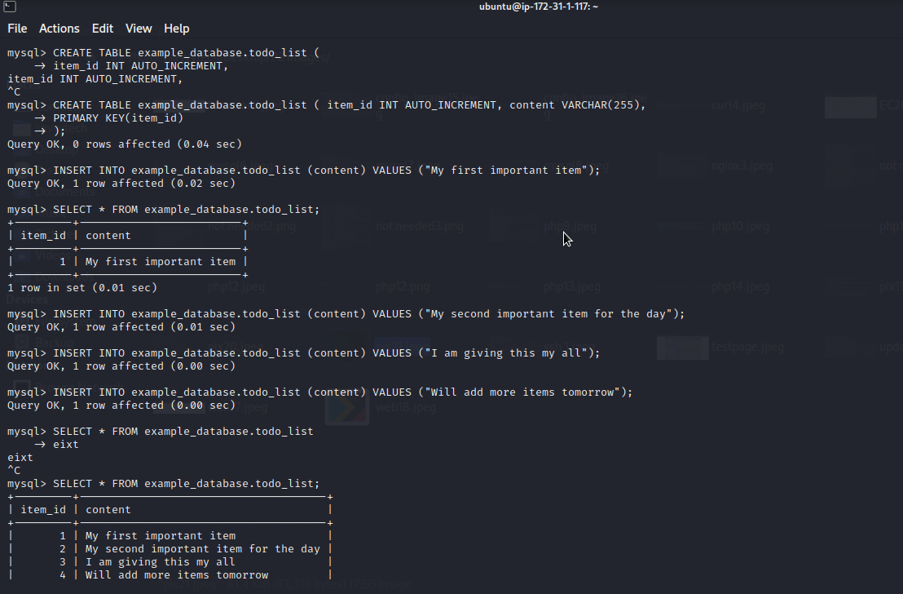

* After confirming that you have valid data in your test table, you can exit the MySQL console:

    `mysql> exit`

* Now you can create a PHP script that will connect to MySQL and query for your content. Create a new PHP file in your custom web root directory using your preferred editor. We’ll use vi for that:

    `vim /var/www/projectLEMP/todo_list.php`

* The following PHP script connects to the MySQL database and queries for the content of the todo_list table, displays the results in a list. If there is a problem with the database connection, it will throw an exception.
 Copy this content into your todo_list.php script:
 Ensure you use the sameusername and password that you created in the database.

        <?php
        $user = "example_user";
        $password = "password";
        $database = "example_database";
        $table = "todo_list";
        
        try {
        $db = new PDO("mysql:host=localhost;dbname=$database", $user, $password);
        echo "<h2>TODO</h2><ol>";
        foreach($db->query("SELECT content FROM $table") as $row) {
            echo "<li>" . $row['content'] . "</li>";
        }
        echo "</ol>";
        } catch (PDOException $e) {
            print "Error!: " . $e->getMessage() . " ";
            die();

Save and close the file when you are done editing.

You can now access this page in your web browser by visiting the domain name or public IP address configured for your website, followed by /todo_list.php:

`http://<Public_domain_or_IP>/todo_list.php`

You should see a page like this, showing the content you’ve inserted in your test table:

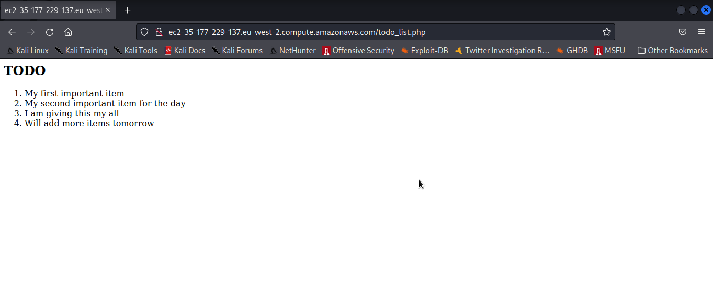

### Well done, Your PHP environment is ready to connect and interact with your MySQL server.

