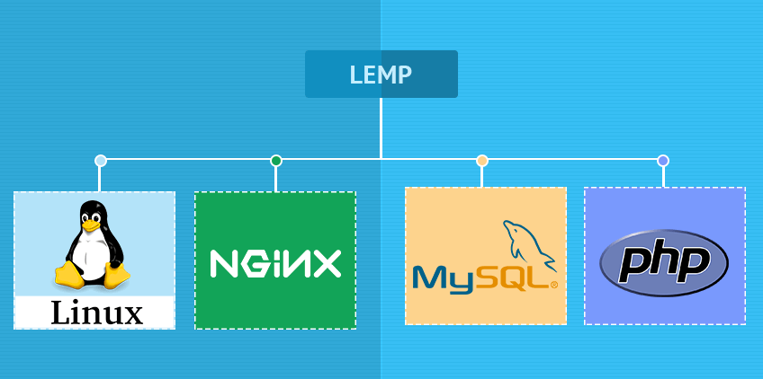

# Project-2-LEMP-Stack-Implementation-on-AWS
This repository explains the steps involved in creating and hosting a LEMP server on AWS. An open-source web application stack called LEMP is used to create websites.
The abbreviation LEMP stands for Linux Operating System, Nginx (pronounced engine-x, hence the E in the acronym), MySQL Database, and PHP Scripting Language.

### Step 1: Create a Virtual Server on AWS
<!-- UL -->
* Login to the AWS console
* Search for EC2 (Elastic Compute Cloud) 
* Select your preferred region (the closest to you) and launch a new EC2 instance of t2.micro family with Ubuntu Server 20.04 LTS (HVM)
* Type a name e.g My_Lamp_Server
 Click create a new key pair, use any name of your choice as the name for the pem file and select .pem.
    * Linux/Mac users, choose .pem for use with openssh. This allows you to connect to your server using open ssh clients.
    * For windows users choose .ppk for use with putty. Putty is a software that lets you connect remotely to servers
* Save your private key (.pem file) securely and do not share it with anyone! If you lose it, you will not be able to connect to your server ever again! 

### Step 2: Installing Apache and Updating the Firewall
* First, update the server using the command

    `sudo apt update`

    

* Now, install nginx using the command below

    `sudo apt install nginx`
      
* Check the status of the nginx service

    `sudo systemctl status nginx`
    
* Access the server locally in the ubuntu shell using cURL

    `curl http://localhost:80`

        or using the ip address in the command below
    `curl http://127.0.0.1:80`

* Open a web browser of your choice and try to access following url 
`http://<Public-IP-Address>:80`

* You can also retrieve your ip address instead of checking the aws console using cURL as in the command below
    `curl -s http://169.254.169.254/latest/meta-data/public-ipv4`
     

